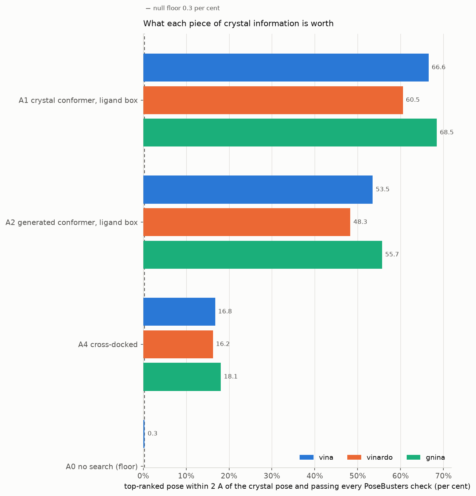
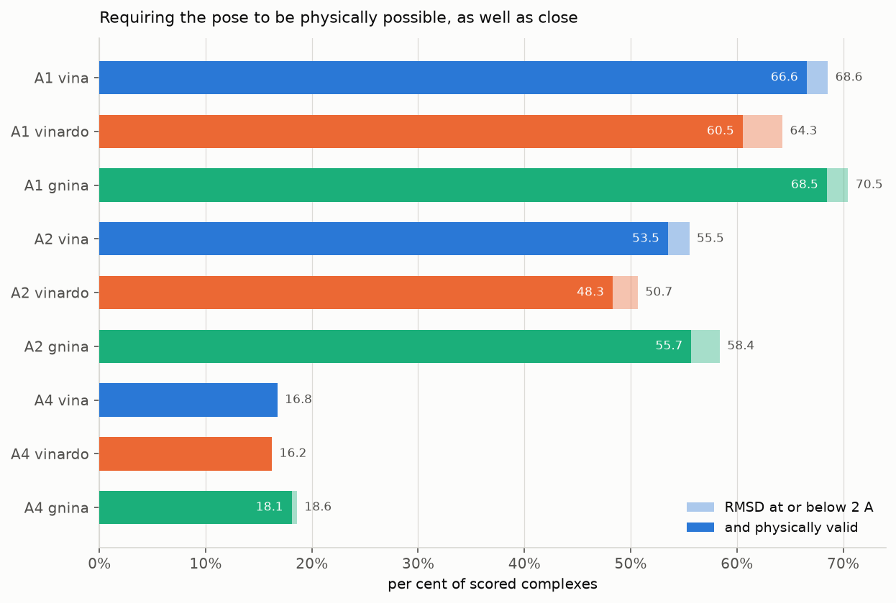
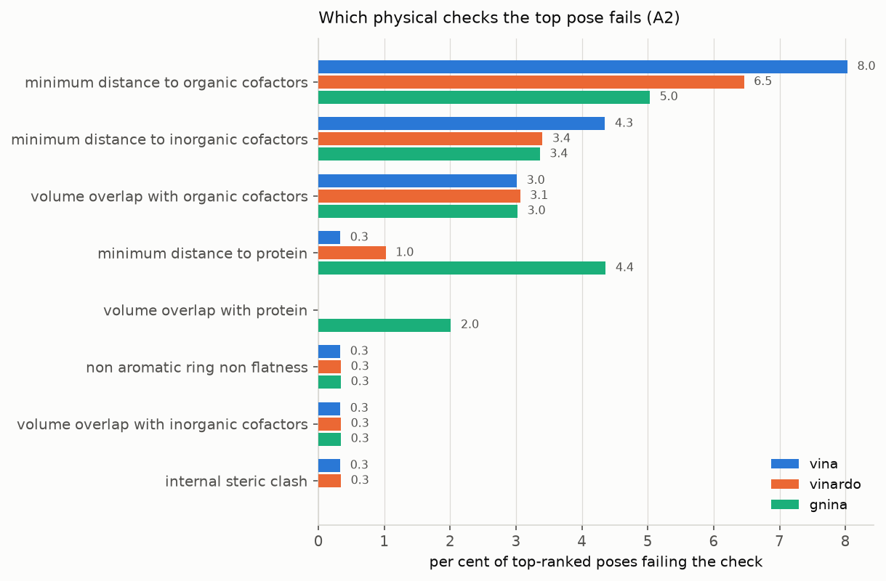
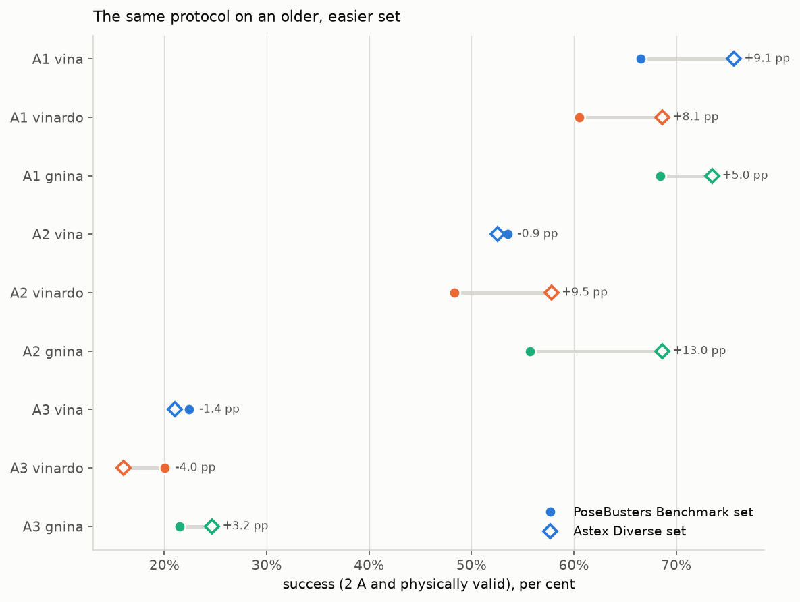
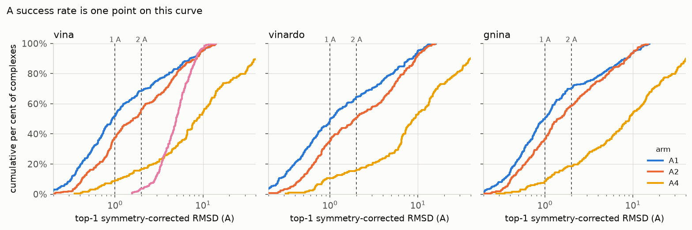
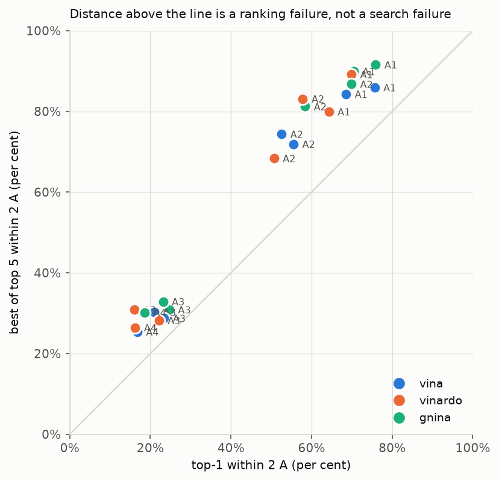
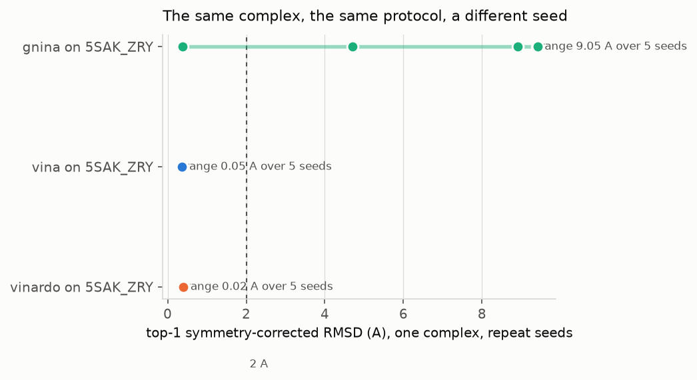
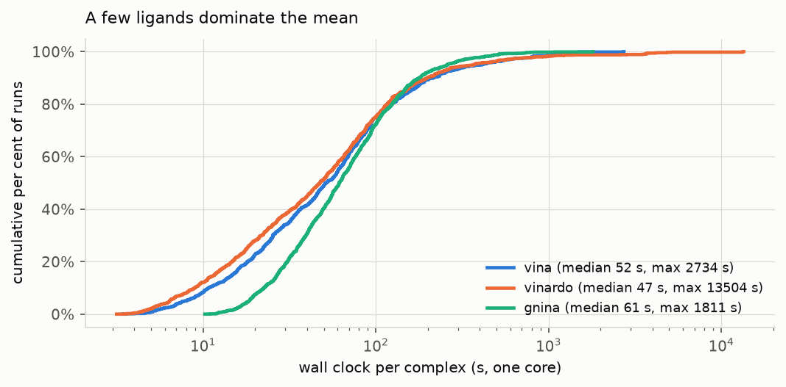
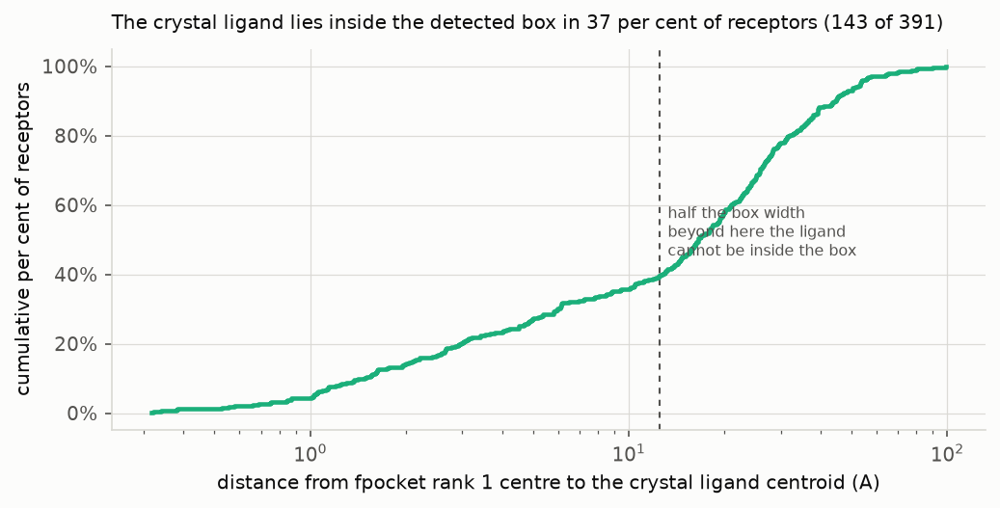

# Two thirds of the quoted docking success rate comes from information a screening campaign does not have

## Summary

AutoDock Vina placed the top-ranked pose within 2 Angstrom of the crystal ligand
for 166 of 299 PoseBusters Benchmark complexes that produced a scorable pose,
which is 55.5 per cent. Requiring that pose to also pass every PoseBusters
physical check drops it to 160, or 53.5 per cent. Vinardo reached 48.3 per cent
and GNINA 55.7 per cent on the same 308-complex set, with the ligand rebuilt from
SMILES and a 25 Angstrom box centred on the crystal ligand. Then the crystal
information was removed one piece at a time. Giving the search the crystal
ligand's own coordinates instead of a generated conformer is worth 13.1
percentage points to Vina. Taking the search box from pocket detection instead of
the crystal ligand is worth 31.1. Removing both leaves Vina at 22.4 per cent
against the 66.6 it scores on the fully informed protocol, a gap of 44.2 points.
Docking into a different PDB structure of the same protein, which is what a
screening campaign actually does, gives 16.8 per cent across 197 pairs. The
floor, obtained by dropping the generated conformer into the box with no search
at all, is 0.3 per cent. GNINA is nominally ahead in every arm once both
benchmark sets are pooled, by between 0.1 and 5.2 points, but every confidence
interval overlaps every other, it loses two of the seven individual cells to
Vina, and its lead in the detected-box arm is one complex out of 379. It is also
the least reproducible of the three: on one complex where Vina returned 0.332 to
0.382 Angstrom across five seeds, GNINA returned 0.376, 9.404, 4.705, 8.905 and
9.425. This benchmark does not separate the three scoring functions. Every number
here is read from a file in `results/` or `logs/` that a script in `scripts/`
wrote. 377 exclusions across four stages are listed with reasons in
`results/excluded.tsv`.

## Background

Docking asks a narrow question. Given a protein structure and a small molecule,
where does the molecule sit, and how good is that fit. Two separate machines
answer it. A search explores the positions, orientations and torsions the
molecule can take inside a defined region of the protein. A scoring function puts
a number on each arrangement, and the search uses that number to decide where to
look next. They fail in different ways, and the fix for one is not the fix for
the other.

The scoring functions here are empirical. Vina's is a weighted sum of five terms:
two Gaussians on interatomic distance, a repulsion term, a hydrophobic term and a
hydrogen-bonding term, plus a penalty proportional to the number of rotatable
bonds. The weights were fitted by regression against measured affinities for a
few hundred complexes. Vinardo is the same shape of function refitted with
different terms and a different training set. GNINA's convolutional network was
trained on a much larger set of poses labelled by proximity to a crystal pose,
and it scores a three-dimensional grid of atom densities rather than a sum over
atom pairs.

None of the three computes an energy. They report numbers in kcal per mole
because the training labels were in those units, and the fit is to a particular
set of complexes with a particular distribution of ligand sizes, protein families
and interaction types. This is the most abused quantity in the field. A docking
score of -9.2 kcal/mol does not license you to say the molecule binds with a
dissociation constant of 170 nanomolar, or that it binds more tightly than one
scoring -8.4. The correlation between docking score and measured affinity across
unrelated targets is weak enough that ranking two different molecules by it is
not supported by the function's own construction. This repository uses the score
for exactly one thing: deciding which of a run's poses is the top-ranked one.
Nothing here measures affinity, and no number in it should be read as one.

A pose can be close to the crystal pose and still be impossible. Nothing in a
docking scoring function enforces chemistry. The search moves atoms, the function
returns a number, and a pose at 1.4 Angstrom can have a flattened aromatic ring,
a bond stretched past its equilibrium length, an internal clash, or a chlorine a
third of a van der Waals radius inside a backbone carbonyl. Some of that comes
from the search taking a shortcut through a barrier the function does not model.
Some comes from the file format: a PDBQT records coordinates and atom types and
throws the bond orders away, so a pose read back without reference to the input
molecule can be a different molecule. Reporting RMSD without validity counts
those as successes. That is what the PoseBusters checks catch, and it is why the
only number called success here requires both.

Self-docking and cross-docking are different questions, and the difference is not
one of degree. In self-docking you take a crystal structure of the protein with
the ligand bound, remove the ligand, and put it back. The pocket was shaped by
the molecule you are replacing: every side chain has already moved to accommodate
it. In cross-docking you dock into a structure of the same protein solved with
something else bound, so the side chains are arranged for a different guest. That
is what virtual screening does every time. The gap between the two numbers in
this repository is 36.8 percentage points.

One more thing about self-docking that is easy to miss. If you hand the program
the ligand's crystal coordinates as its input structure, you have given it more
than a starting point. You have given it the answer's internal geometry, which
the search cannot change for any degree of freedom that is not a rotatable bond:
ring puckers, bond angles, amide planarity. And you have given it the answer's
position inside the box, which the search will not have to find. For a rigid
ligand those two together are most of the problem.

## Data

| | PoseBusters Benchmark set | Astex Diverse set | Cross-docking set |
|---|---|---|---|
| Source | Zenodo record 8278563, CC BY 4.0 | same archive | built here from the RCSB |
| Downloaded | 22 September 2026 | 22 September 2026 | 22 September 2026 |
| Verified against | md5 `f004ac7c4e68317b5348497d2bb6bee6`, fetched from the Zenodo API at run time | same file | RCSB Search and Data APIs |
| In the archive | 428 complexes | 85 | 308 queries considered |
| Used | 308 | 85 | 253 pairs, 241 receptors |
| Excluded at this stage | 120 | 0 | 55 |

The coordinates come from the PoseBusters authors' own archive rather than from
the PDB, so the structures are byte-identical to the ones other people report
numbers on. Reassembling them would mean reproducing their solvent stripping and
cofactor handling, and any difference there moves the success rate invisibly.

That archive holds 428 PoseBusters complexes, which is the preprint version. The
published paper reports on 308, the reduction having been made during peer review
to drop complexes whose ligand sits against a crystal contact. **The 308-member
list is not in the archive**, is not in the authors' GitHub repository, and the
RSC supplementary files returned 404 when I looked on 22 September 2026. The list
used here is the one PoseBench ships, pinned to commit `d2eeef8f`, and
`scripts/02_fetch_benchmarks.sh` verifies on every run that it has exactly 308
entries and is a strict subset of the 428. Every coordinate file still comes from
the authors; only the subset selection is second-hand. Those 120 dropped
complexes are the largest single block in `results/excluded.tsv`.

The cross-docking set was built, not downloaded. For each of the 308 primary
complexes, `scripts/03_build_crossdock_set.py` reads the UniProt accession from
the SIFTS cross-reference and the entity's membership of the RCSB's own 95 per
cent sequence-identity cluster, searches for other X-ray entries carrying that
accession at 2.5 Angstrom or better, keeps those in the same cluster, drops those
whose only heteroatoms are crystallisation additives, drops those bound to the
same chemical component as the query, and takes the highest-resolution survivor.
One partner per query, so no single well-studied target dominates. That took 725
API calls and produced 253 pairs. The 55 queries with no usable partner break
down as 19 with no partner carrying a ligand of interest, 17 with no other entry
of the same protein at the resolution cutoff, 7 whose only partners held the same
ligand, 6 with no UniProt cross-reference, 5 below the identity cutoff, and 1
whose entry the Data API no longer returns.

A further 48 of those 253 pairs were lost in preparation, leaving 205, of which
197 to 199 produced poses depending on the method. **39 of the 48 were dropped
because the two structures differ by more than 3 Angstrom C-alpha RMSD after
superposition**, and that cut is the least comfortable decision in the pipeline.
Those are not a random 39: they are the pairs whose structures differ most, which
is to say the hardest and most interesting cross-docking cases. Excluding them
makes the cross-docking number optimistic rather than neutral. The fix is a local
superposition on binding-site residues instead of a global one, and it is not
done here. Six more were lost because Biopython cannot write a chain identifier
longer than one character, and three to superposition or parsing errors. All are
in `results/preparation/crossdock_align.tsv` with their per-pair C-alpha RMSD.

## Pipeline

Twelve scripts plus three libraries and a self-check, run in order by
`run_all.sh`. Every stage stamps `logs/` when it finishes and skips on a second
run, so a failure at stage 6 is resumed by repeating the same command. Every
script takes `--help`. All shell scripts pass shellcheck with no findings.

### Installation, and why there are four conda environments

The conda-forge smina build pins libboost 1.82 and AutoDock Vina 1.2.7 requires
1.86, so they cannot share an environment. Ask for both and the solver quietly
gives you Vina 1.2.5. Ask for Vina and PoseBusters together and numpy is pulled
below 2, which pulls RDKit back to 2023.09 and PoseBusters back to 0.3.1, two
years of checks missing with no error anywhere. **The first environment solved
for this repository did exactly that, and the versions table is what caught it.**
The docking programs are therefore called by absolute path rather than through an
activated environment.

The fourth environment holds nothing but CUDA libraries. GNINA's release asset is
described as static and is not: `ldd` reports `libcudnn.so.9`, `libcudart.so.12`,
`libcusparse.so.12`, `libcufft.so.11` and `libcusolver.so.11`, and the binary
exits 127 before printing its version on a machine without them, GPU or no GPU.
That environment is never activated; its lib directory goes on `LD_LIBRARY_PATH`
for GNINA calls only, because activating it would put its libstdc++ ahead of the
one RDKit was built against.

Vina comes from conda-forge rather than PyPI. The EasyDock documentation reports
that the 1.2.3 wheel produced unstable docking scores and recommends building
from source. I could not establish whether that defect was in the wheel packaging
or in the 1.2.3 source, so rather than guess about the current wheel this
repository does not use pip for Vina at all.

```bash
bash scripts/00_configure.sh --threads 16 --ram 7 --disk 60 --jobs 10 \
  --data-dir /path/with/room --yes
bash scripts/01_install.sh
```

### Receptor preparation

Waters, crystallisation additives and any stray atoms of the ligand of interest
are stripped, pdb2pqr assigns protonation states with PROPKA at pH 7.4, and Open
Babel writes the PDBQT with Gasteiger charges. All 393 receptors prepared with no
failures. Three decisions in that sentence are not obvious.

pdb2pqr's `--pdb-output` is used rather than its PQR, because the PQR drops every
cofactor: AMBER has no parameters for HEM, FAD, NAD or an iron-sulfur cluster, so
they vanish silently. **133 of the 393 receptors carry at least one cofactor,
18,152 atoms in total**, most often HEM in 17 receptors, NAG in 15 and FAD in 10.
A heme site docked without its heme is a large empty cavity a ligand falls into
and scores well in.

Open Babel types the receptor rather than Meeko, and Meeko is the better tool for
the polymer. Meeko types residues from curated templates rather than perceiving
them, but it cannot type a cofactor it has no template for: asked to handle HEM
it tries to build one from the chemical component dictionary, gets nothing back,
and raises inside `chemtempgen`. Deleting those cofactors is wrong. Hand-writing
templates for the forty-odd cofactors here is a week of work that would break on
the next dataset. Open Babel types every receptor the same way, which also
removes the confound of one protocol for the receptors without cofactors and
another for the ones with them. What it costs is perceived atom types and
Gasteiger charges instead of template-read ones, which matters less than it
sounds for Vina and Vinardo because neither has an electrostatic term.

`--partialcharge gasteiger` is not optional and its absence is silent: without it
Open Babel writes a charge column of `+0.000` for every atom and nothing
complains. Adding it then broke 27 receptors, because Gasteiger assignment
requires kekulization and Open Babel cannot kekulize a heme. Dropping those would
have been a silent exclusion of exactly the most interesting structures, so the
conversion retries without a charge model and records which ran: **361 receptors
typed with charges, 32 without**. Twelve receptors fell back from PROPKA to Open
Babel's protonation and are marked in the same table.

Six PoseBusters receptor files still contain one to four atoms of their own
ligand, left behind by the authors' PyMOL selection: 5SAK_ZRY, 7NR8_UOE,
7Q25_8J9, 7RNI_60I, 7WUX_6OI and 8EX2_Q2Q. One atom is not the answer sitting in
the pocket, but it is a real atom in the grid where the ligand is meant to go, so
it comes out and the count goes in the table.

### Ligand preparation

Two versions per complex, 786 in total. The `refconf` arm uses the crystal
ligand's own coordinates with hydrogens added in place. The `genconf` arm rebuilds
the same molecule from its SMILES with ETKDGv3 and an MMFF relaxation, seeded from
`project.conf`, never aligned to the crystal pose at any point. The SMILES comes
from the crystal SDF rather than the chemical component dictionary, so the
generated molecule is guaranteed to be the same molecule with the same formal
charges.

**The generated conformers are not worse than the ones the PoseBusters authors
ship.** Median best-fit RMSD to the crystal conformer is 1.445 Angstrom over 385
ligands here, against 1.403 for the `ligand_start_conf.sdf` files in their
archive, and 17.6 per cent of mine start beyond 2 Angstrom against 32.1 per cent
of theirs. So the cost of the generated-conformer arm is not an artefact of poor
conformer generation.

### Search boxes

A 25 Angstrom cube, which is what Buttenschoen et al. used for Vina, copied for
comparability rather than because any pocket is 25 Angstrom wide. 393
ligand-centred boxes, 391 detected boxes from fpocket's rank 1 pocket, and 205
boxes on the cross-docking partner's own bound ligand.

fpocket's rank 1 pocket is taken every time with no inspection, because choosing
among its pockets using the crystal ligand would restore exactly the information
the detected-box arm exists to remove. **The result bounds that arm before any
docking happens: the rank 1 centre is within 5 Angstrom of the crystal ligand
centroid for 106 of 391 receptors, 27.1 per cent, and the crystal ligand lies
inside the 25 Angstrom detected box for 143 of 391, 36.6 per cent.** The other
63.4 per cent cannot succeed whatever the scoring function does.

### Docking, and the one protocol choice worth arguing about

Every method writes PDBQT and every pose is read back through Meeko against the
prepared ligand. The obvious alternative is to take smina's SDF output directly,
which it will happily write, and that output has lost its bond orders: RDKit
reads a test pose as `[C]N([N][C]c1[c][c][c][c]c1...` and neither RDKit nor
PoseBusters can match it against the crystal ligand, so the RMSD comes back as
not-a-number and the complex drops out of the success rate without anything being
logged.

Exhaustiveness is left at the programs' default of 8, and that default does not
converge on a 25 Angstrom box. Complex 1HQ2_PH2 has one rotatable bond and a
generated conformer already within 0.21 Angstrom of the crystal conformer; it
returned a top-1 RMSD of **4.57 Angstrom on seed 20260922 and 0.33 Angstrom on
seed 7**, with the receptor, the ligand, the box and the effort identical. At
exhaustiveness 64 both seeds gave 0.37. I raised it to 32 and the full grid
projected to more than sixty hours, with individual PoseBusters receptors taking
ten minutes each. More importantly, running at 32 would mean reporting numbers
from a protocol nobody else runs while quietly departing from the one being
measured. So the default stands and the under-sampling is reported as a result
about the standard protocol. Part of the spread between arms below is sampling
noise, and raising exhaustiveness would move every number here.

GNINA needs its own note. Its default is an ensemble of five CNNs, which on CPU
did not finish one complex in eighteen minutes and was abandoned. The single
`crossdock_default2018` network took 105 seconds on the same complex, and GNINA's
own output recommends exactly that substitution. `--cnn_scoring rescore` applies
the network to the poses the empirical search produced rather than inside the
search, and the two are not interchangeable. Both settings are in `project.conf`
and in every row of `results/runs/`.

### Measurement

The RMSD is PoseBusters' own `robust_rmsd` rather than a local reimplementation,
so the number is computed the same way as the number being compared against, and
its retry chain (charges stripped, tautomers canonicalised, bond orders
reassigned) keeps docked poses from returning not-a-number and silently leaving
the denominator.

There is a trap under the obvious one. RDKit has two symmetry-aware functions and
they answer different questions: `CalcRMS` is computed in place and asks how far
the pose is from the crystal pose, while `GetBestRMS` superposes first and asks
whether the shape is right, so a pose in the wrong subsite can score well on it.
The PoseBusters methods say `GetBestRMS`; their code applies the threshold to the
`CalcRMS` value and reports the other separately. The in-place number is the
right one and it is the one called `rmsd` here.

One more trap, which I fell into. PoseBusters' redock configuration returns the
2 Angstrom verdict as one more boolean alongside its chemistry and geometry
checks. Sweeping every boolean into a validity flag makes "physically valid"
silently mean "physically valid and already within 2 Angstrom", and the two
columns then track each other almost exactly, which is not what those quantities
do. Accuracy is now read from the `rmsd` column and nowhere else.

## Results

### What each piece of crystal information is worth

**Vina's success rate falls from 66.6 per cent on the fully informed protocol to
22.4 when neither the starting conformer nor the search box comes from the
crystal structure, and to 16.8 when the receptor was solved with a different
ligand.**



| Arm | Vina | Vinardo | GNINA | n |
|---|---|---|---|---|
| A1 crystal conformer, ligand-centred box | 66.6 | 60.5 | 68.5 | 294 to 299 |
| A2 generated conformer, ligand-centred box | 53.5 | 48.3 | 55.7 | 294 to 299 |
| A3 generated conformer, detected box | 22.4 | 20.1 | 21.5 | 294 to 299 |
| A4 cross-docked into another structure | 16.8 | 16.2 | 18.1 | 197 to 199 |
| A0 no search, conformer dropped in the box | 0.3 | | | 308 |

Success is RMSD at or below 2 Angstrom and every PoseBusters check passed, on the
PoseBusters Benchmark set. Full table with counts, Wilson intervals and the
1 Angstrom threshold in `results/success_rates.tsv`; the deltas are in
`results/arm_comparison.tsv`.

The null floor is 0.3 per cent, one complex in 308. Knowing the pocket and
nothing else essentially never works, so every rate above it is the search doing
real work rather than geometry.

What each piece of crystal information is worth, in percentage points of success:

| Removed | Vina | Vinardo | GNINA |
|---|---|---|---|
| the starting conformer (A1 to A2) | 13.1 | 12.2 | 12.8 |
| the search box (A2 to A3) | 31.1 | 28.2 | 34.2 |
| both (A1 to A3) | 44.2 | 40.5 | 47.0 |
| the receptor's own ligand (A2 to A4) | 36.8 | 32.1 | 37.6 |

**The box is worth more than twice what the conformer is worth**, and that is the
result I did not anticipate. Published reimplementations put the conformer at
five to nine points on PoseBusters, and 13.1 here is already larger than that,
for a reason the rigid-ligand cases below make visible: crystal coordinates give
away the starting position as well as the internal geometry. But the box is the
bigger lever by a wide margin, and it is the one almost nobody varies.

The detected-box figure has to be read against its own ceiling. fpocket's
top-ranked pocket contains the crystal ligand for only 36.6 per cent of
receptors, so 22.4 per cent is roughly three fifths of what was achievable rather
than a scoring failure. The median top-1 RMSD in that arm is 17.8 Angstrom with a
maximum of 89.5, which is a ligand docked into a pocket on the far side of the
protein, correctly, into the wrong pocket.

Cross-docking costs 36.8 points. The median top-1 RMSD moves from 1.717 Angstrom
to 8.615, and the interquartile range from 0.814 to 4.384 out to 3.647 to 20.600.
This is the number a screening campaign should be calibrated against, and it is a
third of the self-docking figure. Remember that the 39 pairs with the largest
conformational change were excluded, so 16.8 per cent is optimistic.

### Does this benchmark separate the three scoring functions

**No. Every confidence interval overlaps every other in all seven cells, and the
nominal winner changes with the benchmark set.**

| Arm | Dataset | Ordered by success, with 95 per cent Wilson intervals |
|---|---|---|
| A1 | Astex | vina 75.6 [65.1-83.8], gnina 73.5 [63.1-81.8], vinardo 68.7 [58.1-77.6] |
| A1 | PoseBusters | gnina 68.5 [63.0-73.5], vina 66.6 [61.0-71.7], vinardo 60.5 [54.9-66.0] |
| A2 | Astex | gnina 68.7 [58.1-77.6], vinardo 57.8 [47.1-67.9], vina 52.6 [41.6-63.3] |
| A2 | PoseBusters | gnina 55.7 [50.0-61.2], vina 53.5 [47.9-59.1], vinardo 48.3 [42.6-54.0] |
| A3 | Astex | gnina 24.7 [16.6-35.1], vina 21.1 [13.4-31.5], vinardo 16.1 [9.6-25.6] |
| A3 | PoseBusters | vina 22.4 [18.1-27.5], gnina 21.5 [17.2-26.5], vinardo 20.1 [15.9-25.0] |
| A4 | cross-docking | gnina 18.1 [13.4-24.0], vina 16.8 [12.2-22.6], vinardo 16.2 [11.8-22.0] |

GNINA takes five of the seven cells and the highest pooled figure in all four
arms, so if you want a single answer it is the one to pick. The margins do not
support it. Pooled over both sets, GNINA beats Vina by 5.2 points in A2, 1.3 in
A4, 1.2 in A1 and 0.1 in A3, and that last is 84 complexes against 83. Vina takes
A1 on Astex and A3 on PoseBusters outright. Vinardo is last in five cells and
second in two.

Two further reasons not to read a ranking off this table. The seed experiment
below shows GNINA's answer on a single complex moving by 9 Angstrom between
seeds, so a one-run-per-complex benchmark is measuring GNINA with more noise than
it measures the other two. And the set matters: Vinardo beats Vina by 5.3 points
on Astex in arm A2 and loses to it by 5.2 on PoseBusters.

What the table does separate, decisively, is the arms. A 31-point gap between
ligand-centred and detected boxes dwarfs every difference between methods.

### Accuracy against validity

**Between 87 and 90 per cent of top-ranked poses on PoseBusters are physically
valid, and the commonest failure is a clash with a cofactor.**



Requiring validity as well as accuracy costs Vina 2.0 points on PoseBusters, 166
poses within 2 Angstrom reducing to 160 that are also valid. That is smaller than
the accuracy differences between methods, so on this set validity is not what
separates them. It is not negligible either, and it is not free: in cross-docking
the validity rate rises to between 95.0 and 98.0 per cent, because a pose in the
wrong place is usually still a physically possible pose.



The single commonest physical failure for Vina is minimum distance to organic
cofactors, 24 of 299 poses or 8.0 per cent, followed by distance to inorganic
cofactors at 4.3 per cent and volume overlap with organic cofactors at 3.0. That
ordering is the argument for keeping cofactors in the receptor made in reverse:
a third of these receptors have one, poses run into them, and a pipeline that had
silently dropped them would have scored those poses as clean.

### Benchmark choice moves the headline

**The same protocol gives Vina 53.5 per cent on PoseBusters and 52.6 on Astex,
but GNINA gains 13.0 points and Vinardo 9.5 on the older set.**



Astex is meant to be the easier set, and for two of the three methods it is.
Vina is the exception, at 52.6 against 53.5, which is within the confidence
interval of either. The ranking flips: on PoseBusters the order is GNINA, Vina,
Vinardo, and on Astex it is GNINA, Vinardo, Vina. A paper reporting only one of
these sets could honestly claim either ordering.

### The shape behind the fraction

**Half of Vina's PoseBusters poses are inside 1.7 Angstrom and a quarter are
beyond 4.4, so the success rate is a cut through a broad distribution rather than
a description of typical behaviour.**



Median top-1 RMSD, PoseBusters: Vina 1.717 Angstrom with an interquartile range
of 0.814 to 4.384, Vinardo 1.955 (0.740 to 5.757), GNINA 1.440 (0.707 to 4.097).
Cross-docking medians are 8.615, 9.029 and 9.125 with maxima above 74 Angstrom,
which is a ligand placed on the far side of the protein.

### Search against ranking

**Top-5 beats top-1 by 16 to 23 percentage points everywhere, so the search is
finding the right pose and the scoring function is failing to rank it first.**



For Vina on PoseBusters the gap is 16.4 points, for GNINA 22.8, for Vinardo 17.7.
That is a ranking problem, not a search problem, and it has a different fix:
rescore the poses you already have rather than search harder.

Huperzine A makes the mechanism concrete. 1GPK_HUP has zero rotatable bonds. At
every exhaustiveness tried and on both seeds the correct pose was found and
ranked second, at 0.36 to 0.39 Angstrom, while a pose 3.63 Angstrom away was
ranked first. No amount of search fixes that. Given the crystal coordinates as
its starting point the same function ranks the right pose first at 0.25 Angstrom,
because the local optimiser never leaves it. The arm that the standard protocol
reports hides the failure entirely.

### Run-to-run variance

**On one complex, five seeds move Vina by 0.051 Angstrom and GNINA by 9.049, and
GNINA's verdict at the 2 Angstrom line is not unanimous.**



Complex 5SAK_ZRY, seeds 20260922 to 20260926, everything else held fixed:

| Method | Top-1 RMSD across five seeds (Angstrom) | Range | Standard deviation | Verdict |
|---|---|---|---|---|
| vina | 0.332, 0.368, 0.354, 0.382, 0.356 | 0.051 | 0.019 | unanimous |
| vinardo | 0.409, 0.401, 0.396, 0.413, 0.397 | 0.016 | 0.007 | unanimous |
| gnina | 0.376, 9.404, 4.705, 8.905, 9.425 | 9.049 | 3.984 | split |

GNINA finds the right pose on one seed in five and lands nine Angstrom away on
three of the other four, on a complex where both empirical functions are
reproducible to within half an Angstrom. The search underneath GNINA is smina's,
and smina is reproducible here, so the instability is in what the CNN promotes to
rank one out of the pose set the search returned. GNINA has the highest pooled
number in every arm of the table above. It is also the one whose answer you
cannot trust from a single run, and an aggregate that hides that is the more
misleading number.

A second complex found while investigating the exhaustiveness question, 1HQ2_PH2,
swings from 4.57 Angstrom on one seed to 0.33 on another under Vina, so Vina is
not immune either. The experiment selects the first complex in the manifest with
prepared inputs rather than one I chose, which is why it landed on a case that
happens to be easy for two of the three methods. Five seeds on one complex per
method is a thin experiment and the right version runs the whole set several
times, which costs five times the compute and was not affordable here.

### Symmetry correction

**Symmetry correction changes the 2 Angstrom verdict on 4.7 per cent of Vina's
top poses, with a maximum difference of 6.0 Angstrom.**

A naive index-matched RMSD is wrong for any ligand with a symmetric
substructure. For Vina on PoseBusters, 14 of 299 poses cross the 2 Angstrom line
depending on whether the automorphism group is minimised over; for Vinardo 11 of
294 and for GNINA 9 of 298. The median absolute difference is small, 0.029
Angstrom, but the tail is not. Two independent implementations, PoseBusters' own
and spyrmsd, disagree by more than 0.1 Angstrom on 2 poses out of 299, which is
the cheapest available evidence that either is right.

### Cost

**Vina's median complex takes 45 seconds on one core and its slowest takes 1,178,
so the mean is not a useful summary.**



On the generated-conformer arm over PoseBusters, median wall clock per complex
was 45.6 seconds for GNINA, 38.5 for Vinardo and comparable for Vina, with 90th
percentiles of 128 and 139 seconds and maxima of 516 and 1,003. Peak resident
memory per docking process ranged from 388 MB to 1,152 MB, measured across a live
run; Vina is the memory-hungry one, not GNINA, which is the opposite of what I
assumed before measuring. Per-stage elapsed time, peak memory and data growth are
in `logs/summary.tsv`.

### Pocket detection sets the ceiling for the detected-box arm

**fpocket's top-ranked pocket puts the crystal ligand inside a 25 Angstrom box
for 143 of 391 receptors, so the detected-box arm is capped at 36.6 per cent
before any scoring function is involved.**



The median distance from the rank 1 pocket centre to the crystal ligand centroid
is 16.5 Angstrom, and 106 of 391 receptors put it within 5 Angstrom. This is a
result about pocket detection rather than about docking, and it has to be stated
alongside any A3 number or that number reads as a scoring failure when most of it
is not.

Against that ceiling, the detected-box arm reached 22.4 per cent for Vina, 21.5
for GNINA and 20.1 for Vinardo. Two thirds of the 36.6 per cent that pocket
detection left achievable, and the rest of the arm's failure is the pocket
finder rather than the scoring function. A better pocket detector would raise
this arm without any change to the docking.

The commonest physical failure in this arm is the same as everywhere else but
worse: minimum distance to an organic cofactor fails on 26 of 299 Vina poses,
8.7 per cent, against 8.0 in the ligand-centred arm. A box placed by geometry
rather than by a known ligand lands on cofactor sites more often, which is what
you would expect and is visible in the waterfall.

## Repository structure

```
vina_gnina_pose_benchmark_pipeline/
  config/
    sources.tsv                 every external source and the identifier it is
                                pinned to, with who publishes the checksum
    env_analysis.yml            preparation, measurement, figures, report
    env_vina.yml                AutoDock Vina alone, on libboost 1.86
    env_smina.yml               smina and fpocket, on libboost 1.82
    env_gnina_runtime.yml       the CUDA libraries GNINA needs to start
    env_*.lock.yml              the solved environments, pinned
    dataset_posebusters.tsv     308 rows, one per complex
    dataset_astex.tsv           85 rows
    dataset_excluded.tsv        dropped at stage 2, with reasons
    crossdock_pairs.tsv         253 pairs
    crossdock_excluded.tsv      55 queries with the step that rejected each
    boxes.tsv                   989 boxes, centres and provenance
  scripts/
    00_configure.sh             measure, project, refuse, write project.conf
    01_install.sh               four environments, GNINA, record versions
    02_fetch_benchmarks.sh      fetch, verify against the published md5
    03_build_crossdock_set.py   query the RCSB, build the pairs
    04_prepare.py               receptors, ligands, cross-docking references
    05_define_boxes.py          ligand-centred, detected and partner boxes
    06_dock.sh                  one arm, one method, one dataset, with the gate
    07_score_poses.py           symmetry-corrected RMSD and the physical checks
    08_analyse.py               success rates, deltas, distributions, waterfall
    09_figures.py               the nine figures above
    10_report.qmd               the full report
    check_repo.sh               the claims this README makes, checked
    lib_common.sh               config, timing, stage stamps
    lib_vgb.py                  config, TSV, receptor cleaning, RMSD
    lib_dock.py                 the per-complex docking loop and the disk gate
    lib_manifest.py             archive to dataset manifests
  results/
    success_rates.tsv           the headline table
    arm_comparison.tsv          what each piece of information is worth
    rmsd_distributions.tsv      median and interquartile range per cell
    timing_distributions.tsv    wall clock per complex, as a distribution
    pb_failure_waterfall.tsv    which checks fail, per method
    symmetry_effect.tsv         how often correction moved a verdict
    seed_variance.tsv           the same complex, repeat seeds
    convergence.tsv             the exhaustiveness grid; empty here, see
                                scripts/06_dock.sh --convergence
    excluded.tsv                377 rows, every complex dropped anywhere
    headline.tsv                the numbers this summary uses
    dataset_counts.tsv          set sizes before and after exclusions
    data_provenance.tsv         URLs, checksums, download dates
    crossdock_set_summary.tsv   cutoffs, pair counts, rejection reasons
    environment/                versions.tsv, tool_licences.tsv, lock specs
    preparation/                per-receptor, per-ligand, per-pair outcomes
    poses/pose_scores.tsv       one row per pose
    scored/run_scores.tsv       one row per run
    report/10_report.html       the rendered report
  figures/                      the nine figures, all from 09_figures.py
  data/                         not tracked; data/README.md says what belongs
  logs/                         per-stage elapsed time, peak memory, disk growth
  project.conf                  written by 00_configure.sh; not tracked
  run_all.sh
```

## Usage

Total disk is about 5.5 GB, of which 2.1 GB is the GNINA binary, roughly 3 GB is
four conda environments including the CUDA runtime, and 3.1 GB is the data
directory. The repository itself is under 15 MB. Point `--data-dir` at a
filesystem with room; on the machine this was developed on it is not inside the
working tree.

**If you are running under WSL, read `data/README.md` first.** Both disk gates
measure the filesystem from inside the virtual machine, where `df` reported 894
GB free while the Windows host drive fell below 2 GB, because the Linux
filesystem lives in a thin-provisioned `ext4.vhdx` that grows one-for-one and
never shrinks. Per-run scratch goes to `/dev/shm` for that reason.

Memory is not the binding constraint, but it is not nothing: one Vina process on
a 25 Angstrom box ranged from 388 MB to 1,152 MB across a live run, so ten
concurrent jobs need more than 7 GB. `00_configure.sh` sizes the job count from
that figure and warns when it clamps.

```bash
# 1. Measure the machine and write project.conf. Seconds.
bash scripts/00_configure.sh --threads 16 --ram 7 --disk 60 --jobs 10 \
  --data-dir /scratch/vgb_bench_data --yes

# 2. Four conda environments and a 2.1 GB GNINA download over eight
#    connections. 113 s when everything is already present.
bash scripts/01_install.sh

# 3. Benchmark sets, verified against the md5 the Zenodo API publishes.
#    4 s once cached, 211 MB unpacked.
bash scripts/02_fetch_benchmarks.sh

# 4. Build the cross-docking set from the RCSB. 725 API calls.
python scripts/03_build_crossdock_set.py --config project.conf

# 5. Receptors, ligands and cross-docking references. 2,510 s for 393
#    receptors at 10 jobs; 508 MB.
python scripts/04_prepare.py --config project.conf --jobs 10

# 6. Search boxes, fpocket on every receptor. 1,012 s.
python scripts/05_define_boxes.py --config project.conf --jobs 10

# 7. Docking. The long one. 5,521 s for 299 Vina complexes at 5 jobs.
bash run_all.sh --from 06_dock --jobs 10

# 8 to 11. Scoring at roughly 2.7 s per run, then aggregation,
#    figures and the report.
python scripts/07_score_poses.py --config project.conf --jobs 10
python scripts/08_analyse.py --config project.conf
python scripts/09_figures.py --config project.conf
quarto render scripts/10_report.qmd
```

Everything at once, resuming wherever it stopped:

```bash
bash run_all.sh --jobs 10
```

A wiring check that finishes in minutes, and the self-check:

```bash
bash run_all.sh --smoke
bash scripts/check_repo.sh
```

## Limitations

One benchmark set tells you about that benchmark set. Every complex here has a
solved crystal structure of the protein with that ligand bound, at a resolution
good enough to pass the curators' filters. That is not a sample of the targets
you care about, it is a sample of the targets that crystallised. Membrane
proteins are under-represented, allosteric and disordered sites barely appear,
and every receptor is a conformation some ligand successfully induced. The
population where docking works best is exactly the population these sets are
drawn from. The 13-point spread between Astex and PoseBusters for GNINA is a
warning about how far any single headline number travels.

Receptor preparation was fixed, not explored. One protonation protocol, one
charge model, one additive list, one decision about cofactors. Each of those
moves the success rate and the size of the movement is not measured here. Running
the whole thing again with a different preparation is the obvious next experiment
and this repository does not answer it.

The search is not converged. Exhaustiveness 8 on a 25 Angstrom box gives a
seed-dependent verdict on at least some complexes, demonstrated at 4.57 against
0.33 Angstrom for 1HQ2_PH2 under Vina and at a 9.05 Angstrom spread for GNINA on
5SAK_ZRY. That is a property of the protocol the field quotes, and it is reported
rather than worked around, but it means some of the spread between arms here is
sampling noise. Raising exhaustiveness would move every number in this README.

The seed-variance experiment is one complex per method. That is enough to show
the problem exists and nowhere near enough to size it. The honest version reruns
the whole set under several seeds and reports the distribution of success rates
rather than a point estimate, which costs five times the compute. Read every
percentage here as a single draw.

The detected-box arm measures pocket detection at least as much as it measures
docking. fpocket rank 1 was used every time with no alternative considered,
because any selection among its pockets using the crystal ligand would restore
the information the arm exists to remove. A different detector, or a consensus
over the top few pockets, would give a different number, and the 22.4 per cent
here should not be read as what blind docking can achieve in general.

The cross-docking arm is optimistic. 39 of 253 pairs were dropped for exceeding a
3 Angstrom C-alpha RMSD after global superposition, and those are precisely the
pairs with the largest conformational change. A local superposition on
binding-site residues would keep most of them and would almost certainly lower
the 16.8 per cent figure further.

Nine of 308 complexes fail in Vina and its derivatives because the receptor
contains xenon, molybdenum or boron, which their atom typing does not cover.
Those are counted in the attempted column and appear in `results/excluded.tsv`.

A pose is not an affinity and this repository measures nothing about affinity. It
does not test whether any of these functions can tell a binder from a non-binder,
rank a congeneric series, or enrich actives from decoys. A method that places
poses well can still be useless for all three.

The physical checks are PoseBusters' checks and their thresholds. Whether a bond
length is within bounds depends on the reference geometry and the tolerance
chosen, and both are theirs.

## Data availability

Benchmark structures: Zenodo record 8278563, `posebusters_paper_data.zip`,
53,660,397 bytes, md5 `f004ac7c4e68317b5348497d2bb6bee6`, downloaded 22 September
2026, CC BY 4.0. The 308-member subset list: `BioinfoMachineLearning/PoseBench`,
`data/posebusters_pdb_ccd_ids.txt`, commit `d2eeef8f`. Cross-docking structures:
RCSB PDB via the Search and Data APIs, CC0 1.0. Full provenance with checksums in
`results/data_provenance.tsv` and `config/sources.tsv`.

Everything in `results/` and `figures/` is tracked. Nothing in `data/` is;
`data/README.md` says what belongs there and how to get it.

## Citation

If you use this repository, cite the tools and benchmark sets rather than the
repository. Every DOI below was checked against its publisher on 22 September
2026.

Buttenschoen M, Morris GM, Deane CM. PoseBusters: AI-based docking methods fail
to generate physically valid poses or generalise to novel sequences. Chem Sci.
2024;15(9):3130-3139. doi:10.1039/D3SC04185A

Trott O, Olson AJ. AutoDock Vina: improving the speed and accuracy of docking
with a new scoring function, efficient optimization, and multithreading. J Comput
Chem. 2010;31(2):455-461. doi:10.1002/jcc.21334

Eberhardt J, Santos-Martins D, Tillack AF, Forli S. AutoDock Vina 1.2.0: New
docking methods, expanded force field, and Python bindings. J Chem Inf Model.
2021;61(8):3891-3898. doi:10.1021/acs.jcim.1c00203

Koes DR, Baumgartner MP, Camacho CJ. Lessons learned in empirical scoring with
smina from the CSAR 2011 benchmarking exercise. J Chem Inf Model.
2013;53(8):1893-1904. doi:10.1021/ci300604z

McNutt AT, Li Y, Meli R, et al. GNINA 1.3: the next increment in molecular
docking with deep learning. J Cheminform. 2025;17:28.
doi:10.1186/s13321-025-00973-x

Meli R, Biggin PC. spyrmsd: symmetry-corrected RMSD calculations in Python. J
Cheminform. 2020;12:49. doi:10.1186/s13321-020-00455-2

Hartshorn MJ, Verdonk ML, Chessari G, et al. Diverse, high-quality test set for
the validation of protein-ligand docking performance. J Med Chem.
2007;50(4):726-741.

Riniker S, Landrum GA. Better informed distance geometry: using what we know to
improve conformation generation. J Chem Inf Model. 2015;55(12):2562-2574.

Jurrus E, Engel D, Star K, et al. Improvements to the APBS biomolecular solvation
software suite. Protein Sci. 2018;27(1):112-128. doi:10.1002/pro.3280

O'Boyle NM, Banck M, James CA, Morley C, Vandermeersch T, Hutchison GR. Open
Babel: An open chemical toolbox. J Cheminform. 2011;3:33.
doi:10.1186/1758-2946-3-33

Le Guilloux V, Schmidtke P, Tuffery P. Fpocket: an open source platform for
ligand pocket detection. BMC Bioinformatics. 2009;10:168.
doi:10.1186/1471-2105-10-168

RDKit: Open-source cheminformatics. https://www.rdkit.org

Versions actually installed are in `results/environment/versions.tsv`: AutoDock
Vina 1.2.7, smina 2020.12.10, GNINA v1.3.3, PoseBusters 0.6.5, RDKit 2026.03.6,
Meeko 0.8.0, spyrmsd 0.9.0, PDB2PQR 3.6.1, Open Babel 3.2.1, fpocket 4.2.2,
Biopython 1.88, Python 3.12.14.

## License

MIT for the code in this repository. See `LICENSE`, which also lists the licence
of every tool and benchmark set used and the date each was checked. The licences
the package manager reports for what was actually installed are in
`results/environment/tool_licences.tsv`.
